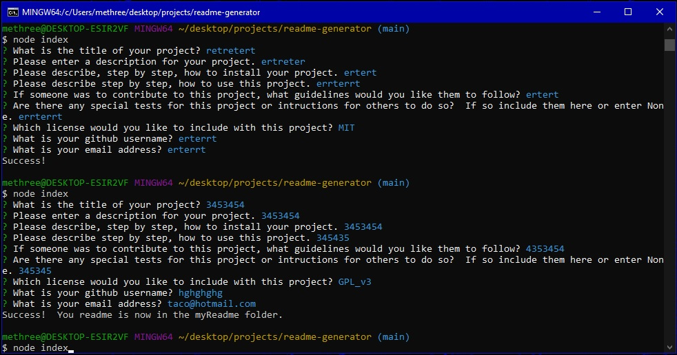

 

  <h1 align="center">README Generator</h1>

## Description 

This handy little app can be used to generate a readme file with markdown language.

## Table of Contents

* [Installation](#installation)
* [Usage](#usage)
* [Contributing](#contributing)
* [Tests](#tests)
* [License](#license)
* [Questions](#questions)

## Installation

Simply clone the code onto your machine and be sure to install dependencies with 'npm install'.

## Usage 

To run this app use 'node index' then follow the onscreen instructions.  Once your are done look in the 'myReadme' folder for your completed readme!

## Contributing

No contributions at this time please, but your are free to use this code in your own project given the license listed below.

## Tests

I welcome any tests or suggestions to better this project in the future.

## License

This project is covered under the MIT license.

## Questions

I can be contacted via email or on github at:

* E-mail: johntaylorwoodland@gmail.com
* Github: https://github.com/jondagamkd/

